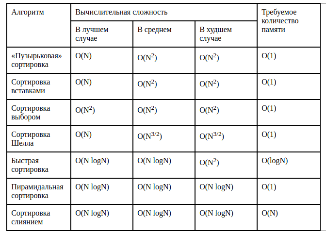
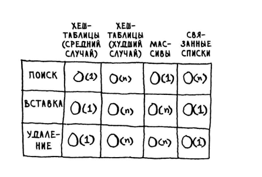
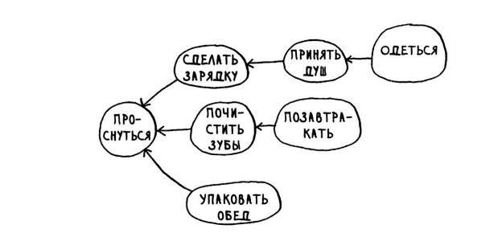
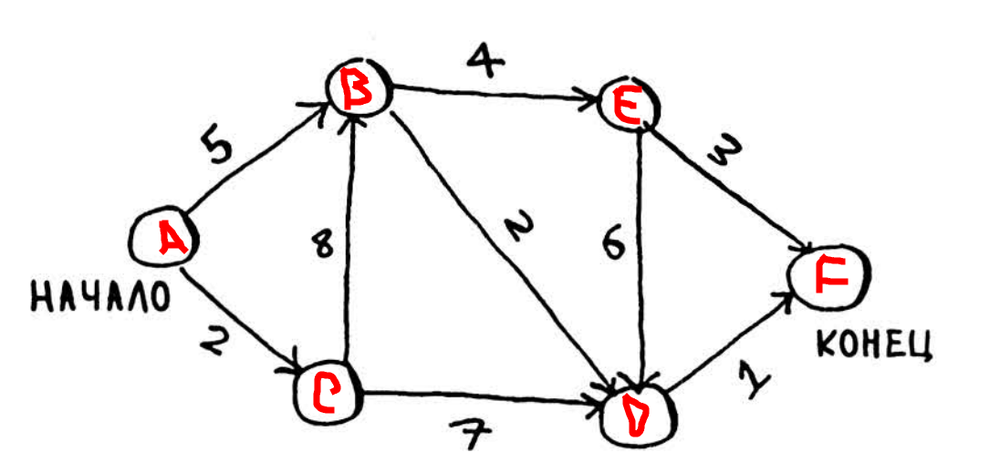

# Сортировки и их эффективность

# Прочие заметки

Эффективность быстрой сортировки `quickSort` зависит от выбора опорного элемента.
Лучше всего брать рандомный элемент, чтобы получить эффективность `O(n log n)`

Не смотря на меньшую эффективность `быстрой сортировки` перед `сортировкой слиянием`.
Константа для вычисления у `быстрой сортировки` меньше и 
как следствие `быстрая сортировка` может оказаться эффективнее по-факту.

`Константа` в эффективности алгоритма, это грубо говоря побочные вычисления в рамках одной операции `N`

# Хэш-таблицы
## Основа
`Хэш таблица` это структура данных, состоящая из массива и хэш-функции.
С помощью хэш-функции мы можем найти нужный элемент в массиве с эффективностью `O(1)`.

Мы передаем искомое значение в хэш-функцию, получаем ключ массива, должен быть числом.
`Хэш-таблицы` по другому: "ассоциативные массивы", "словари", "отображения", "хэш-карты", "хэши"

Преобразование доменов в ip отличный пример хэш-таблицы.

## Колизии
При возникновении колизии на месте указанного ключа, создается связанный список.

Т.к. это массив, то количество ячеек может закончится и когда 70% ячеек заполнится, желательно пересоздавать хэш-таблицу с массивом в два раза больше

Очень важно чтобы хэш-таблицы имели хорошее распределение. Наихудший случай - это когда есть одна ячейка в которой лежил связанный список.

## Эффективность хэш-таблиц, массивов и связанных списков

# Графы

`Граф` - это набор связей, состоящий из `узлов` и `ребер`.
Узел может быть соединен напрямую с несколькими другими узлами - такие узлы называются `соседями`

Графы не имеющие ребер в обратном направлении называются `деревьями`/

Граф может быть направленным и ненаправленным.  
`Направленный` - это когда отношения действуют только в одну (соседнюю) сторону.
`Ненаправленный` - это когда отношения действуют во все стороны (соседние).

Граф может быть взвешенным и нет. Взвешенный это когда ребра имеют вес.

## Поиск в ширину 

Этот алгоритм находит путь с минимальным количеством сегментов.

Позволяет определить:
1) Существует ли путь из `А` в `В`
2) Если путь существует, то алгоритм находит близжайший путь
Сложность равна `O(количество узлов + количество ребёр)`

## Пример топологически отсортированного граффа

## Алгоритм Дейкстры

Используется чтобы найти кратчайший путь с весами.
Работает только с `направленными ациклическими графами`

Алгоритм работает верно только с положительными весами рёбер.
Если в графе присутствуют рёбра с отрицательным весом, то используется `Алгоритм Беллмана-Форда`

## Реализация

### Пример задачи
Необходимо найти наиболее короткий (по весу) путь из `А` в `F`.

#### Решение:

##### Шаг 1.